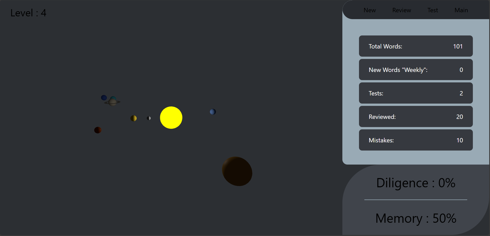
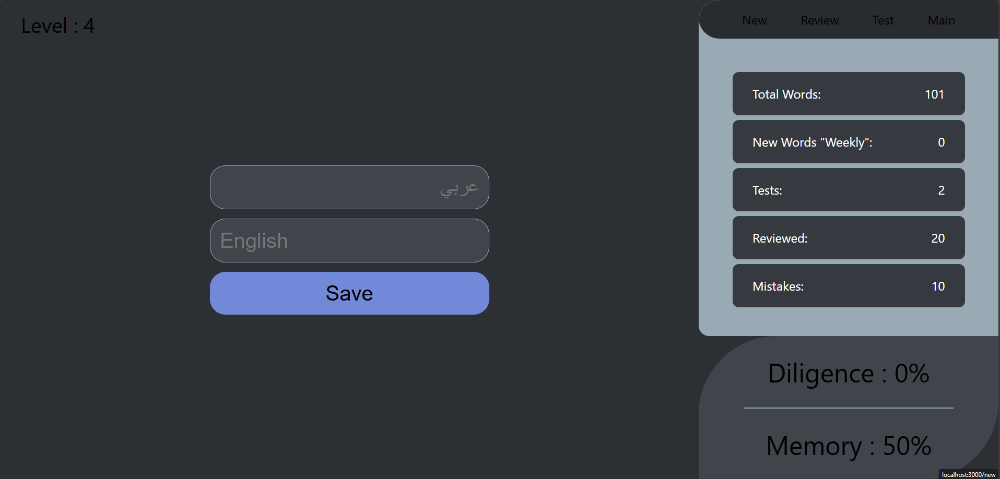
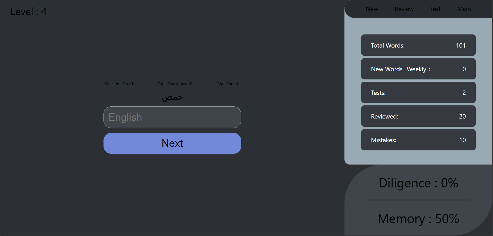
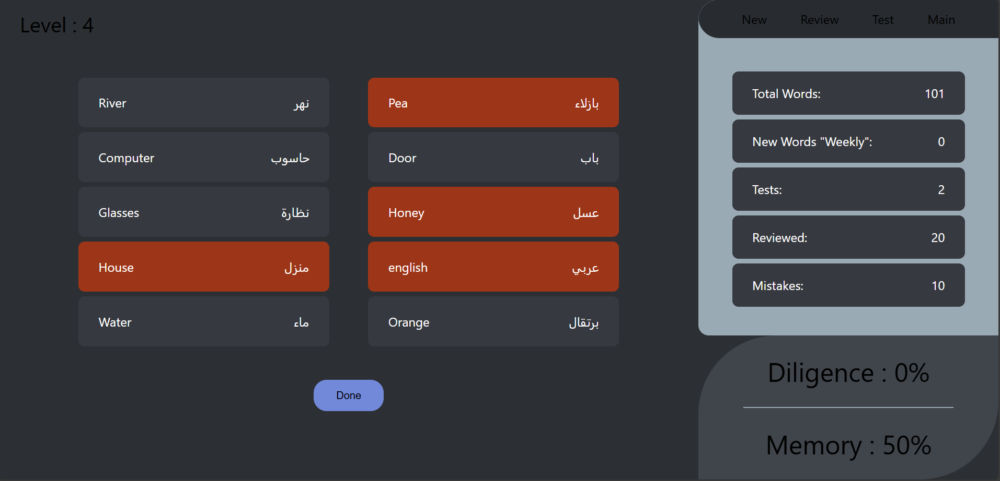

<!-- # Getting Started with Create React App

This project was bootstrapped with [Create React App](https://github.com/facebook/create-react-app).

## Available Scripts

In the project directory, you can run:

### `npm start`

Runs the app in the development mode.\
Open [http://localhost:3000](http://localhost:3000) to view it in your browser.

The page will reload when you make changes.\
You may also see any lint errors in the console.

### `npm test`

Launches the test runner in the interactive watch mode.\
See the section about [running tests](https://facebook.github.io/create-react-app/docs/running-tests) for more information.

### `npm run build`

Builds the app for production to the `build` folder.\
It correctly bundles React in production mode and optimizes the build for the best performance.

The build is minified and the filenames include the hashes.\
Your app is ready to be deployed!

See the section about [deployment](https://facebook.github.io/create-react-app/docs/deployment) for more information.

### `npm run eject`

**Note: this is a one-way operation. Once you `eject`, you can't go back!**

If you aren't satisfied with the build tool and configuration choices, you can `eject` at any time. This command will remove the single build dependency from your project.

Instead, it will copy all the configuration files and the transitive dependencies (webpack, Babel, ESLint, etc) right into your project so you have full control over them. All of the commands except `eject` will still work, but they will point to the copied scripts so you can tweak them. At this point you're on your own.

You don't have to ever use `eject`. The curated feature set is suitable for small and middle deployments, and you shouldn't feel obligated to use this feature. However we understand that this tool wouldn't be useful if you couldn't customize it when you are ready for it.

## Learn More

You can learn more in the [Create React App documentation](https://facebook.github.io/create-react-app/docs/getting-started).

To learn React, check out the [React documentation](https://reactjs.org/).

### Code Splitting

This section has moved here: [https://facebook.github.io/create-react-app/docs/code-splitting](https://facebook.github.io/create-react-app/docs/code-splitting)

### Analyzing the Bundle Size

This section has moved here: [https://facebook.github.io/create-react-app/docs/analyzing-the-bundle-size](https://facebook.github.io/create-react-app/docs/analyzing-the-bundle-size)

### Making a Progressive Web App

This section has moved here: [https://facebook.github.io/create-react-app/docs/making-a-progressive-web-app](https://facebook.github.io/create-react-app/docs/making-a-progressive-web-app)

### Advanced Configuration

This section has moved here: [https://facebook.github.io/create-react-app/docs/advanced-configuration](https://facebook.github.io/create-react-app/docs/advanced-configuration)

### Deployment

This section has moved here: [https://facebook.github.io/create-react-app/docs/deployment](https://facebook.github.io/create-react-app/docs/deployment)

### `npm run build` fails to minify

This section has moved here: [https://facebook.github.io/create-react-app/docs/troubleshooting#npm-run-build-fails-to-minify](https://facebook.github.io/create-react-app/docs/troubleshooting#npm-run-build-fails-to-minify) -->
# Getting Started with Vocabulary App

This project is a web application for learning and memorizing English-Arabic vocabulary easily, with features for testing, reviewing mistakes, and tracking progress.

## Available Scripts

In the project directory, you can run:

### `npm start`

Runs the app in development mode.  
Open [http://localhost:3000](http://localhost:3000) to view it in your browser.

The page will reload when you make changes.  
You may also see any lint errors in the console.

### `npm test`

Launches the test runner in interactive watch mode.

### `npm run build`

Builds the app for production to the `build` folder.  
It correctly bundles React in production mode and optimizes the build for the best performance.

The build is minified, and the filenames include hashes.  
Your app is ready to be deployed!

### `npm run eject`

**Note: this is a one-way operation. Once you `eject`, you can't go back!**

If you aren't satisfied with the build tool and configuration choices, you can `eject` at any time. This command will remove the single build dependency from your project.

Instead, it will copy all the configuration files and transitive dependencies (webpack, Babel, ESLint, etc.) right into your project so you have full control over them.

## API Endpoints

| Method | Endpoint | Description |
|--------|---------|-------------|
| `GET` | `/words` | Retrieve all words |
| `POST` | `/words` | Add a new word |
| `GET` | `/LastTest` | Get last test results |
| `POST` | `/LastTest` | Save test results |
| `GET` | `/Statistics/1` | Get user statistics |
| `PATCH` | `/Statistics/1` | Update statistics |

## Folder Structure

```
src/
├── components/
│   ├── New/           # Add new words
│   │   └── New.js
│   ├── Review/        # Review mistakes
│   │   └── Review.js
│   ├── Test/          # Vocabulary tests
│   │   └── Test.js
│   ├── Statistics/    # Display user statistics
│   │   └── Statistics.js
│   └── SolarSystem/   # Visual effect
│       └── SolarSystem.js
├── assets/
│   ├── images/        # Static images
│   └── videos/        # Video files
├── App.css            # Global styles
├── App.js             # Main component
└── index.js           # Entry point
```

## Screenshots

<div align="center">
    <h5>Home Page</h5>
    
    <h5>Add New Words Page</h5>
    
    <h5>Review Words Page</h5>
    
    <h5>Last Test Review Page</h5>
    
    <h5>Video</h5>
    <video src="src/image/site.mp4" width="1000" controls>
        Your browser does not support video playback.
    </video>
</div>


## License

This project is licensed under the MIT License.

## Contributions

Contributions are welcome! Feel free to open an Issue or Pull Request for improvements.

## Contact

your-email@example.com

    # البدء مع تطبيق تعلم المفردات

هذا المشروع هو تطبيق ويب لتعلم وحفظ الكلمات الإنجليزية-العربية بسهولة، مع ميزات الاختبار، مراجعة الأخطاء، وتتبع التقدم.

## الأوامر المتاحة

في دليل المشروع، يمكنك تشغيل الأوامر التالية:

### `npm start`

يشغل التطبيق في وضع التطوير.  
افتح [http://localhost:3000](http://localhost:3000) في متصفحك لعرضه.

سيتم إعادة تحميل الصفحة عند إجراء تغييرات.  
قد ترى أيضًا أي أخطاء lint في وحدة التحكم.

### `npm test`

يشغل أداة اختبار التطبيق في وضع المراقبة التفاعلي.

### `npm run build`

يبني التطبيق للإنتاج داخل مجلد `build`.  
يقوم بتجميع React في وضع الإنتاج وتحسين الأداء.

يتم تصغير الملفات وإضافة تجزئة للأسماء.  
التطبيق جاهز للنشر!

### `npm run eject`

**ملاحظة: هذه عملية لا رجعة فيها. بمجرد تشغيل `eject`، لا يمكنك العودة!**

إذا لم تكن راضيًا عن أداة البناء والإعدادات الحالية، يمكنك تشغيل `eject` لإزالة الاعتماد الأحادي على الأداة.

بدلاً من ذلك، سيتم نسخ جميع ملفات الإعداد والاعتمادات التلقائية (مثل Webpack، Babel، ESLint) إلى مشروعك، مما يمنحك تحكمًا كاملاً.

## نقاط نهاية API

| الطريقة | المسار | الوصف |
|--------|---------|-------------|
| `GET` | `/words` | جلب جميع الكلمات |
| `POST` | `/words` | إضافة كلمة جديدة |
| `GET` | `/LastTest` | جلب نتائج آخر اختبار |
| `POST` | `/LastTest` | حفظ نتائج الاختبار |
| `GET` | `/Statistics/1` | جلب الإحصائيات |
| `PATCH` | `/Statistics/1` | تحديث الإحصائيات |

## هيكل المشروع

```
src/
├── components/
│   ├── New/           # إضافة كلمات جديدة
│   │   └── New.js
│   ├── Review/        # مراجعة الأخطاء
│   │   └── Review.js
│   ├── Test/          # اختبارات المفردات
│   │   └── Test.js
│   ├── Statistics/    # عرض الإحصائيات
│   │   └── Statistics.js
│   └── SolarSystem/   # تأثيرات بصرية
│       └── SolarSystem.js
├── assets/
│   ├── images/        # الصور الثابتة
│   └── videos/        # ملفات الفيديو
├── App.css            # الأنماط العامة
├── App.js             # المكون الرئيسي
└── index.js           # نقطة الدخول
```

## لقطات من التطبيق

<div align="center">
<h5>الصفحه البدايه</h5>
    

<h5>الصفحه اضافه الكلمات الجديده</h5>


<h5>الصفحه مراجعه الكلمات</h5>
    

<h5>الصفحه مراجعه اخر اختبار </h5>
    

<h5> فديو </h5>
<video src="src/image/الموقع.mp4" width="1000" controls>
    متصفحك لا يدعم تشغيل الفيديو.
</video>

    

</div>

## الرخصة

هذا المشروع مرخص تحت رخصة MIT.

## المساهمة

المساهمات مرحب بها! لا تتردد في فتح Issue أو Pull Request لأي تحسينات.

## التواصل

your-email@example.com

